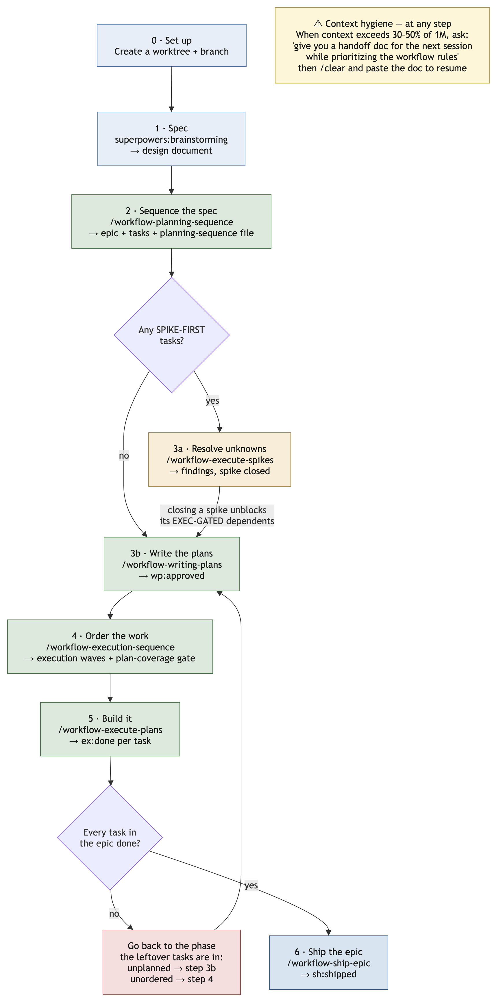

# Beadspowers: Python

A structured AI-assisted development workflow for Claude Code that combines
**Beads** (git-backed issue tracking) with **Superpowers** (plan-execute-verify lifecycle) into an enforced sequence.

It ships **two lanes** that share one rule set:

```
Single-task   Start -> Plan -> Refine -> Execute -> Verify -> Ship (PR)
Epic-batch    Spec  -> Sequence -> Plan all -> Order -> Build all -> Ship epic
```

The **single-task** lane is the default: one Beads task, you in the loop at every
gate. The **epic-batch** lane takes a whole epic and fans it out across detached
Claude Workflow runs — one agent per task, worktree-isolated — stopping only at
budget gates and a few review/smoke/ship gates. Scope picks the lane, not
phrasing: one task → single-task; an epic or a spec → epic-batch.

## The epic-batch process



*Editable source: [`docs/workflow-process-flow.drawio`](docs/workflow-process-flow.drawio) (the PNG has the diagram XML embedded, so draw.io can open either one).*

| Step | You run | You get |
|------|---------|---------|
| **0** | Create a worktree + branch | An isolated workspace |
| **1** | `superpowers:brainstorming` | A spec / design document |
| **2** | `/workflow-planning-sequence` | An epic + tasks, classified and ordered into planning waves |
| **3a** | `/workflow-execute-spikes` *(only if there are `SPIKE-FIRST` tasks)* | Findings files; closing a spike unblocks its `EXEC-GATED` dependents |
| **3b** | `/workflow-writing-plans` | One approved plan per task (`wp:approved`) |
| **4** | `/workflow-execution-sequence` | Execution waves + a plan-coverage gate |
| **5** | `/workflow-execute-plans` | Implemented, QA'd tasks (`ex:done`) |
| **6** | `/workflow-ship-epic` | One PR for the whole epic (`sh:shipped`) |

**If tasks are left over after step 5,** go back to the phase those tasks are
actually in — unplanned tasks re-enter at **3b**, unordered ones at **4**. The
`wp:*` / `sk:*` / `ex:*` / `sh:*` Beads labels tell you where each one stopped,
which is also what makes a crashed or interrupted run resumable. There is
deliberately no separate status command.

> ### ⚠️ Context hygiene — applies at every step
>
> When your context exceeds roughly **30–50% of 1M**, ask Claude to
> **"give you a handoff doc for the next session while prioritizing the workflow
> rules"**, then `/clear` and paste that doc back in to restart with clean
> context. Long sessions degrade the workflow before they degrade the code — the
> router and the hard stops are the first things to fall out of an overfull
> context, and once they do, steps get silently skipped.

## Features

### Verification

Python-specific multi-phase verification with three tiers. After execution completes, the workflow recommends the appropriate tier based on change size.

| Tier | Phases | When to Use |
|------|--------|-------------|
| **Quick** | Lint + tests | Small changes (< 50 lines), hotfixes |
| **Standard** | Lint + code review + architecture + simplification + tests | Normal tasks (50-200 lines) |
| **Full** | All 13 phases with parallel agents (lint through security) | Major features (200+ lines), pre-release |

**Tooling:** ruff (lint/format), mypy (type checking), pytest (tests), python -m build (packaging).

Verification is a **hard gate, not a suggestion**. `beads-ship-task` refuses to
ship until a `python-verification-{level}` skill has run and written
`.beads/.verification-done`; in the batch lane the equivalent is a per-task
`ex:qa:<level>` label. Running `pytest` or `ruff` by hand does **not** satisfy
either — only the named skill does.

### Plan Refinement

After Superpowers planning completes, Claude analyzes the plan and asks targeted questions — a mix of Critical, Recommended, and Nice-to-Have — to refine the plan before execution. Each question includes options with reasoning and a recommendation. Skip at any stage by typing "skip."

One methodology, two modes: the single-task lane runs it **interactively**
(`plan-refinement-qa`, live Q&A); the batch lane runs the same engine
**autonomously** inside `workflow-writing-plans` Step 4, because a detached
Workflow cannot pause for input. Shared logic lives in
`Commands/workflow-commands/references/refinement-methodology.md`.

### Enforced Workflow Sequence

The router (`beads-workflow-router.md`) is the authority document — it outranks
any "next step" handoff a skill suggests at its own end. It enforces:

1. **Start** — `beads-start-task` marks the issue `in_progress`, creates a feature branch
2. **Plan** — `superpowers:writing-plans` writes a plan to `docs/plans/`
3. **Refine** — `plan-refinement-qa` runs Q&A to stress-test the plan
4. **Summarize** — `plan-summary-console` prints the refined plan in the console
5. **Execute** — User chooses sequential (`superpowers:executing-plans`) or parallel (`superpowers:subagent-driven-development`)
6. **Verify** — `beads-post-execution` auto-invokes, runs the matching verification tier
7. **Ship** — `beads-ship-task` commits, pushes, opens a PR, closes the beads issue

Plus these hard stops: no direct coding after task start; `systematic-debugging`
first on `bug` tasks; verification before any ship or "done"; ready-task lists
scoped to the active epic; and a standing posture that **named scope is
authorization** (with an explicit hard-lock list that isn't).

### Natural Language Triggers

**Single-task lane**

| Say This | Invokes |
|----------|---------|
| "What's ready?" | `beads:ready` (scoped to active epic) |
| "I'm starting [task]" | `beads-start-task` |
| "Plan this" | `superpowers:writing-plans` |
| "Refine the plan" | `plan-refinement-qa` |
| "Summarize the plan" | `plan-summary-console` |
| "Execute the plan" | Execution gate (sequential vs subagent-driven) |
| "Ship it" | `beads-ship-task` (always opens a PR) |
| "Quick verify" | `python-verification-quick` |
| "Standard verify" | `python-verification-standard` |
| "Full verify" | `python-verification-full` |
| "I found a critical bug" | `hotfix-interrupt` |
| "Export progress" | `beads-export-progress` |

**Epic-batch lane** — these need the word *epic* (or a spec) to route here

| Say This | Invokes |
|----------|---------|
| "Decompose this spec" / "Sequence the spec" | `workflow-planning-sequence` |
| "Plan the epic" / "Write all the plans" | `workflow-writing-plans` |
| "Run the spikes" | `workflow-execute-spikes` |
| "What order do I ship this epic?" | `workflow-execution-sequence` |
| "Execute the epic" / "Build the whole epic" | `workflow-execute-plans` |
| "Ship the epic" | `workflow-ship-epic` |

When scope is genuinely ambiguous, Claude asks before fanning out — the batch
lane spends real multi-agent budget and a wrong guess is expensive.

## Prerequisites

### Claude Code

Install [Claude Code](https://docs.anthropic.com/en/docs/claude-code) (CLI, desktop app, or IDE extension).

### Required Plugins

Install these Claude Code plugins in order. Run each command inside Claude Code (not your shell).

#### 1. Beads (git-backed issue tracker)

```
/install-plugin beads from steveyegge/beads
```

- **What it provides:** `beads:*` skills (create, list, show, ready, close, sync, etc.) and the `bd` CLI for git-backed issue tracking
- **Scope:** user (available across all projects)
- **Repo:** [steveyegge/beads](https://github.com/steveyegge/beads)

After installing, initialize beads in your project:

```bash
bd init
```

#### 2. Superpowers

```
/install-plugin superpowers from anthropics/claude-plugins-official
```

- **What it provides:** `superpowers:*` skills (writing-plans, executing-plans, subagent-driven-development, brainstorming, systematic-debugging, test-driven-development, verification-before-completion, etc.)
- **Scope:** project
- **Repo:** [anthropics/claude-plugins-official](https://github.com/anthropics/claude-plugins-official)

#### 3. Commit Commands

```
/install-plugin commit-commands from anthropics/claude-plugins-official
```

- **What it provides:** `commit-commands:*` skills (commit, commit-push, commit-push-pr, clean_gone)
- **Scope:** project

#### 4. Codex (optional)

```
/install-plugin codex from openai-codex
```

- **What it provides:** `codex:*` skills — delegate tasks to OpenAI Codex CLI
- **Scope:** project

### System Dependencies

The hooks in `.claude/hooks/` require:

| Tool | Purpose | Install |
|------|---------|---------|
| `jq` | JSON parsing in hook scripts | `brew install jq` (macOS) |
| `gh` | GitHub CLI for PR creation and code review | `brew install gh` then `gh auth login` |

## Installation

### 1. Copy the `.claude/` folder

Merge the contents of this repo's `.claude/` directory into your target project's `.claude/` directory:

```bash
# From your target project root:
cp -rn /path/to/this-repo/.claude/ .claude/
```

> **Note:** Use `cp -rn` (no-clobber) to avoid overwriting existing files. If you already have a `.claude/settings.json`, merge the `hooks` section manually.

### 2. Merge settings.json

If your project already has `.claude/settings.json`, merge these sections from the exported `settings.json`:

**Hooks** (required for automation):

```json
{
  "hooks": {
    "PreToolUse": [
      {
        "matcher": "Bash",
        "hooks": [{ "type": "command", "command": "\"$CLAUDE_PROJECT_DIR\"/.claude/hooks/validate-bash.sh" }]
      },
      {
        "matcher": "Write|Edit",
        "hooks": [{ "type": "command", "command": "\"$CLAUDE_PROJECT_DIR\"/.claude/hooks/write-safety.sh" }]
      }
    ]
  }
}
```

**Enabled plugins** (add to your existing list):

```json
{
  "enabledPlugins": {
    "commit-commands@claude-plugins-official": true,
    "superpowers@claude-plugins-official": true,
    "codex@openai-codex": true
  }
}
```

### 3. Make hooks executable

```bash
chmod +x .claude/hooks/*.sh
```

### 4. Initialize Beads

> **Skip this step** if you already have a `.beads/` directory or have previously installed Beads in your project.

```bash
bd init
```

This creates the `.beads/` directory for issue tracking.

### 5. Replace the placeholders

These files are written to work as-is except for a handful of angle-bracket
placeholders. Search `.claude/` for them and substitute your project's values:

| Placeholder | Replace with |
|-------------|--------------|
| `<owner>/<repo>` | Your GitHub repo |
| `src/<your_package>/` | Your package path |
| `<project>_test` | Your test database name |
| `<run-command>` | How your project starts (`python -m yourpkg`, `uvicorn app:main`, a CLI entrypoint…) |
| `<epic-id>` / `<task-id>` | Illustrative only — no change needed |

Also review the two git conventions the workflow assumes, and relax them
together if your project differs: **PRs are required** (no direct push to
`master` / `main`), and branch prefixes are `feat/`, `fix/`, `refactor/`,
`exp/`, `hotfix/`, `chore/`.

## What's Included

```
.claude/
├── agents/                              # Parallel verification subagents
│   ├── verification-comment-analyzer.md # Docstring + comment quality
│   ├── verification-silent-failure.md   # Error handling gaps
│   ├── verification-test-coverage.md    # Test coverage analysis
│   └── verification-type-analyzer.md    # Type design quality
├── Commands/
│   └── workflow-commands/               # Custom workflow skills
│       ├── beads-start-task.md          # Start task + create branch
│       ├── beads-ship-task.md           # Commit, PR, branch cleanup, close task
│       ├── beads-post-execution.md      # Post-execution verification
│       ├── beads-export-progress.md     # Regenerate a PROGRESS.md snapshot
│       ├── beads-import-prd.md          # Import a PRD into beads issues
│       ├── plan-refinement-qa.md        # Plan Q&A before execution
│       ├── plan-summary-console.md      # Console recap of the refined plan
│       ├── hotfix-interrupt.md          # Emergency hotfix flow
│       ├── python-verification-*.md     # Quick/Standard/Full tiers
│       ├── P02–P14 phases               # Individual verification phases
│       ├── tdd-test-writer.md           # TDD test scaffolding
│       ├── workflow-planning-sequence.md   # Spec/epic -> classified planning waves
│       ├── workflow-writing-plans.md       # Fan-out plan authoring + refinement
│       ├── workflow-execute-spikes.md      # Throwaway prototypes -> findings
│       ├── workflow-execution-sequence.md  # Execution waves + plan-coverage gate
│       ├── workflow-execute-plans.md       # Worktree fan-out, TDD, QA, smoke
│       ├── workflow-ship-epic.md           # Integrate + close a whole epic
│       └── references/
│           └── refinement-methodology.md   # Shared refinement engine (both modes)
├── hooks/                               # Shell automation scripts
│   ├── validate-bash.sh                 # Pre-validate bash commands
│   └── write-safety.sh                  # Prevent writes to protected paths
├── rules/
│   ├── 0_Beads x Superpowers/
│   │   ├── beads-workflow-router.md     # Authority doc: NL -> skill routing + hard stops
│   │   ├── skill-usage.md               # Fully-qualified skill names + naming conventions
│   │   ├── beads-plugin-cli-only.md     # The beads plugin has no MCP layer
│   │   └── bug-must-have-epic.md        # Every bug gets an epic parent
│   ├── Git Best Practices/
│   │   ├── Git Best Practices.md        # Branch naming, releases, rollback
│   │   ├── no-direct-push-to-master.md  # PRs required
│   │   └── protect_plans_and_commit_all.md  # Plans are permanent; safe staging
│   └── critical ai agent rule.md        # Hard locks: destructive git, cloud, branches
├── settings.json                        # Hook wiring + plugin enables
docs/
├── workflow-process-flow.drawio         # Editable process diagram
└── workflow-process-flow.drawio.png     # Rendered, with XML embedded
```

### Verification Phases (Full)

| Phase | Skill | Tier |
|-------|-------|------|
| P02 | Lint Issues Fix (ruff + mypy) | Quick, Standard, Full |
| P03 | Code Review Checks | Standard, Full |
| P04 | Architecture Validation (5-layer) | Standard, Full |
| P05 | Code Simplification Review | Standard, Full |
| P06 | Type Design Analysis | Full (agent) |
| P07 | Silent Failure Hunt | Full (agent) |
| P08 | Comment/Docstring Analysis | Full (agent) |
| P09 | Confidence Scoring | Standard, Full |
| P10 | False Positive Filtering | Standard, Full |
| P11 | Final Verification (ruff + pytest) | Quick, Standard, Full |
| P11.5 | Build Validation (python -m build) | Full |
| P12 | Test Coverage Analysis | Full (agent) |
| P14 | Security Review (auto-triggered) | Standard, Full |

### Architecture Layers

The verification phases validate against a 5-layer Python architecture:

| Layer | Purpose | Allowed Dependencies |
|-------|---------|---------------------|
| **API/CLI** | Routes, CLI commands, entry points | Services, Core |
| **Services** | Business logic, orchestration | Domain, Data, Core |
| **Domain** | Core business rules, entities | Core only |
| **Data** | Repositories, database access | Core only |
| **Core** | Shared utilities, config | None (leaf layer) |

## Customization

### Verification Phases

The P02–P14 phase commands and verification agents are Python-focused, using **ruff** for linting/formatting, **mypy** for type checking, and **pytest** for testing. To adapt for other languages, modify the phase files and agents in `.claude/Commands/workflow-commands/` and `.claude/agents/`, and rename the `python-verification-*` skills — the router and `beads-post-execution` reference them by name.

### Model tiers in the batch lane

The `workflow-*` commands pin a model **tier** (`opus` / `sonnet`), never a
version. Tiers resolve to whatever generation the session runs, which is what
keeps these files from going stale; a versioned id like `claude-opus-4-8` is not
a valid `opts.model` value and would pin the fan-out to a superseded model. The
tier is settled configuration — it is never printed in a budget preview and
never offered to the user as a choice.

### Adding a design-fidelity gate

`workflow-execute-plans` assumes no visual surface. If your project has a UI
worth checking against a design source, add a stage label between
`ex:qa:<level>` and `ex:done` and gate on it the same way the QA level is gated.

### settings.json

The exported `settings.json` includes permissions and plugin enables. Review and adjust:

- `permissions.allow` — Empty by default; add tool-specific permissions as needed
- `permissions.deny` — Add safety rails as needed (e.g., prevent destructive commands)
- `enabledPlugins` — Keep superpowers, codex, and commit-commands; remove any you don't use
