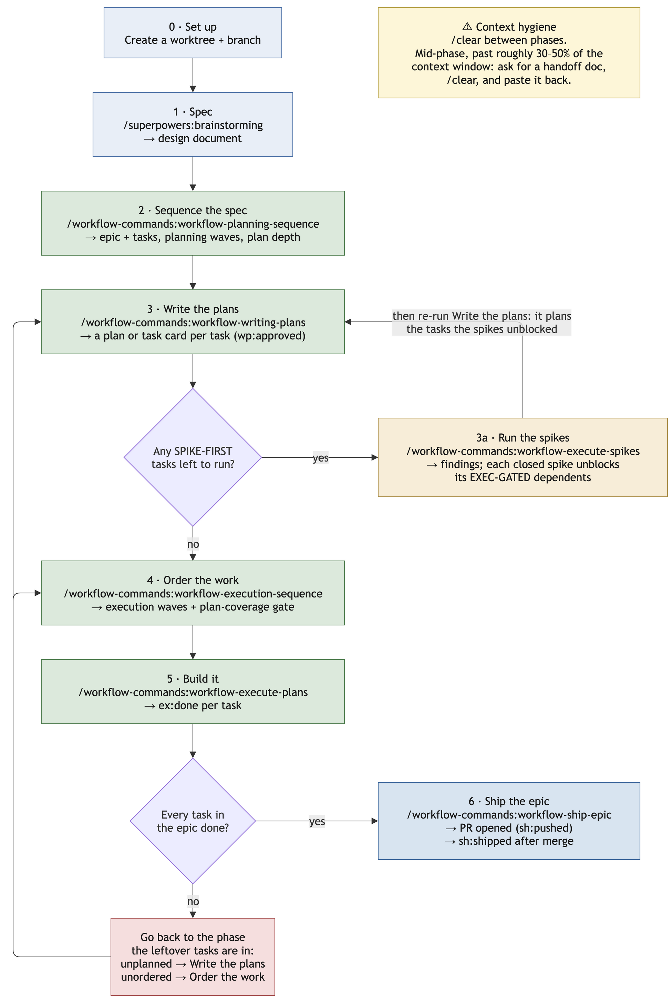

# Beadspowers: Python

Beadspowers is a Claude Code workflow for Python projects that combines **Beads** issue tracking with the **Superpowers** plan → execute → verify lifecycle, and enforces the order. Work one task at a time with you in the loop, or hand Claude a whole epic to plan and build across parallel agents.

## Set up (once per project)

1. Install the system tools (the workflow is verified with beads 1.0.4):

   ```bash
   brew install jq gh
   gh auth login
   npm install -g @beads/bd
   ```

2. Install the plugins, inside Claude Code:

   ```
   /plugin marketplace add steveyegge/beads
   /plugin install beads@beads-marketplace
   /plugin install superpowers@claude-plugins-official
   /plugin install commit-commands@claude-plugins-official
   /plugin marketplace add openai/codex-plugin-cc
   /plugin install codex@openai-codex
   ```

   The last two lines add the Codex plugin. Only the full verification tier's adversarial review uses it, so skip them if you don't use Codex.

3. From your project root, start a setup branch and copy the workflow in. `cp -n` never overwrites your files (it exits 1 when it skips one). If you already had a `.claude/settings.json`, merge this repo's `hooks` and `enabledPlugins` into it by hand.

   ```bash
   git switch -c chore/workflow-setup
   cp -Rn /path/to/beadspowers-python/.claude/. .claude/
   ```

4. Make the hooks executable:

   ```bash
   chmod +x .claude/hooks/*.sh
   ```

5. Set up beads. `bd init` makes its own commit on the current branch. Beads sync through a Dolt remote on your git host, and `.beads/issues.jsonl` stays an untracked, readable export. The workflow's own state files (`.session-state.json`, `.workflow-step`, `.verification-done`) are ignored too, so a ship never commits them. The final `bd dolt push` seeds the new remote once: until it holds data, `bd dolt pull` fails with "no branches found". Pushing publishes your beads on that remote (a `refs/dolt/data` ref in the same repository), so on a public repository the bead text is public.

   ```bash
   bd init --skip-agents
   bd config set export.git-add false
   printf '\nno-auto-import: true\n' >> .beads/config.yaml
   printf '\nissues.jsonl\n.session-state.json\n.workflow-step\n.verification-done\n' >> .beads/.gitignore
   git rm --cached --ignore-unmatch .beads/issues.jsonl
   bd dolt remote add origin git+https://github.com/<owner>/<repo>.git
   bd dolt push
   ```

6. Find the placeholders and replace each one with your project's value:

   ```bash
   grep -rn -e '<owner>/<repo>' -e 'src/<your_package>/' -e '<project>_test' -e '<run-command>' .claude/
   ```

7. Commit the setup and open a PR. Merge it before your first task, because task branches start from the trunk; then update your local trunk: `git switch main && git pull` (use `master` if that is your trunk).

   ```bash
   git add .claude .beads/config.yaml .beads/.gitignore
   git commit -m "chore: add the Beadspowers workflow"
   git push -u origin HEAD
   gh pr create --fill
   ```

8. Start a new Claude Code session in the project.

## One task

1. `/beads:ready`
2. `/workflow-commands:beads-start-task <task-id>` — Claude announces the lane; in Lane C it asks the refinement questions and the execution choice.
3. Verification runs automatically after execution.
4. `/workflow-commands:beads-ship-task` — opens the PR and closes the bead.
5. Merge the PR, then update your local trunk: `git switch main && git pull` (use `master` if that is your trunk).
6. `/clear`

## An epic



1. From the main checkout, after `git switch main && git pull`: `git worktree add ../<project>-<epic> -b feat/<epic-slug>`, then `cd ../<project>-<epic> && claude`
2. `/superpowers:brainstorming` — the approved spec lands in `docs/plans/`. When it asks you to review the written spec, review it, then go to step 3 instead of approving there: approving makes brainstorming start writing an implementation plan, and the epic's plans come from steps 4–6.
3. `/clear`
4. `/workflow-commands:workflow-planning-sequence --spec docs/plans/<date>-<topic>-design.md` — creates the epic; note its id.
5. `/clear`
6. `/workflow-commands:workflow-writing-plans <epic-id>`
7. `/clear`
8. Only if the epic has spike tasks:
   1. `/workflow-commands:workflow-execute-spikes <epic-id>`
   2. `/clear`
   3. `/workflow-commands:workflow-writing-plans <epic-id>` again — it plans the tasks the spikes unblocked.
   4. `/clear`
9. `/workflow-commands:workflow-execution-sequence <epic-id>`
10. `/clear`
11. `/workflow-commands:workflow-execute-plans <epic-id>`
12. `/clear`
13. `/workflow-commands:workflow-ship-epic <epic-id>` — opens the PR.
14. Merge the PR, then, in the main checkout, update your local trunk: `git switch main && git pull` (use `master` if that is your trunk).
15. `/workflow-commands:workflow-ship-epic <epic-id>` again — confirms the merge and marks the epic shipped.
16. `/clear`

If tasks are left over after step 11, unplanned ones go back to step 6 and unordered ones to step 9.

**Context tip:** past roughly 30–50% of the context window in the middle of a phase, ask Claude for a handoff doc for the next session, `/clear`, and paste the doc back in.

## What's inside

- `.claude/rules/` — the router (`0_Beads x Superpowers/beads-workflow-router.md`) and the rules it enforces; start here.
- `.claude/Commands/workflow-commands/` — the single-task and epic-batch commands, plus the `python-verification-*` tiers.
- `.claude/agents/` — the review agents the full verification tier runs.
- `.claude/skills/` — troubleshooting skills, such as beads in a worktree.
- `.claude/hooks/` — the Bash and file-write safety hooks wired up in `settings.json`.
